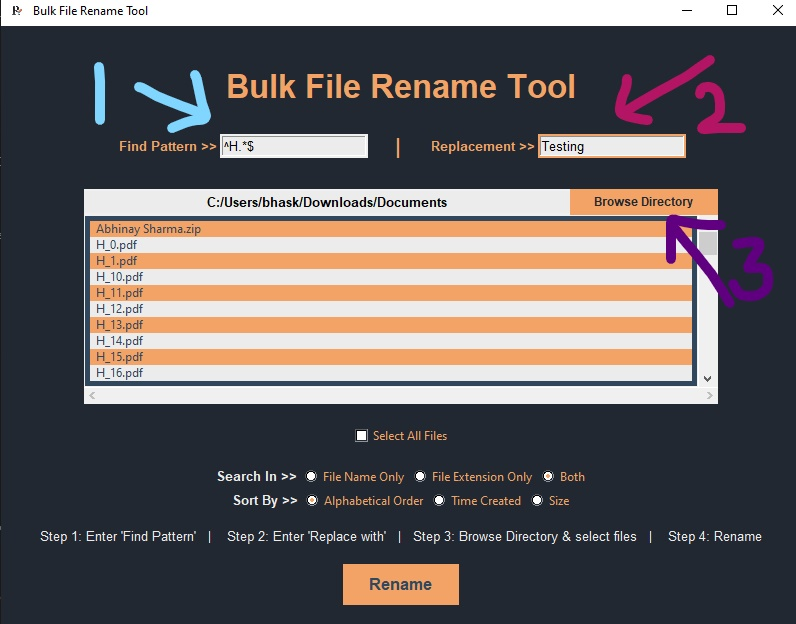
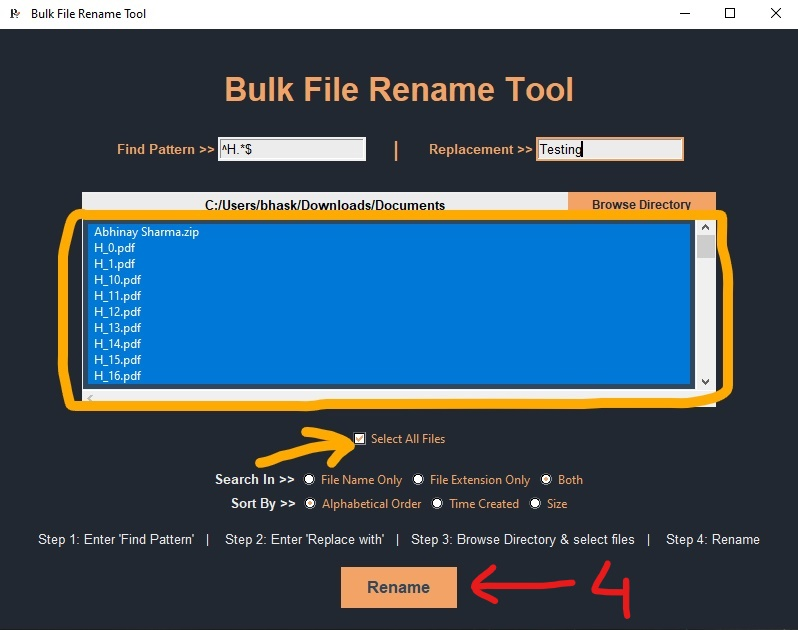
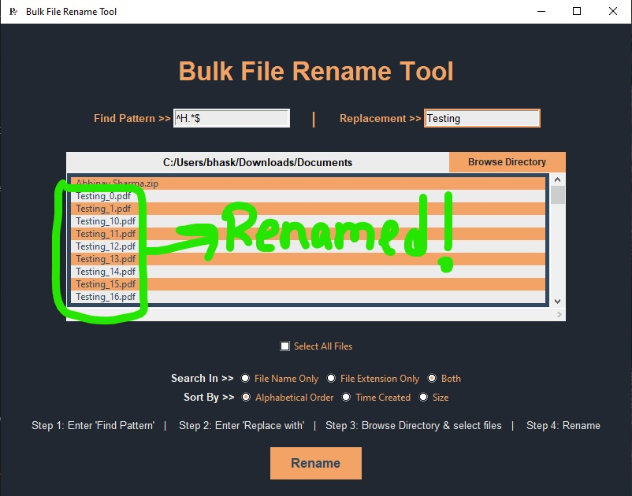

# Bulk File Rename Tool

    Bulk File Rename Tool is a Graphical User Interface(GUI) application mainly intended for enhancing users' experience while renaming a large number of files in a specific directory with a naming convension. It uses 'RegEx' that allows users to rename specific files depending on the RegEx pattern provided by the user.


# Key Features!

- Rename all files in a specified directory with any specified naming convension followed by continuous numbering.
- Build with **_RegEx searcher_** that allows a user to search or select some specific files according to the pattern provided.
- Depending on the user’s requirements, they can specify the renaming order based on alphabetical order, time of file creation, or file size.
- Users can also search files based on the file name or file extension or the full filename .
- The tool can also be used in command line interface(CLI) by providing the searching pattern, naming convension and the directory as arguments.

## Goal

    The ultimate goal of this project is to ease the process of renaming bulk files within a fraction of time without any human error. Renaming a large number of files can be sometime a very tedious work to do, which can be simplified with a tool that does it in a fraction of time without any mistakes.

## Dependencies

- **os**
- **sys**
- **RegEx**
- **Pillow**
- **NumPy**
- **Tkinter**

## Usage

Bulk File Rename Tool can be used in two ways. Either in Graphical User Interface(GUI) or in Command Line Interface(CLI).

### Graphical User Interface(GUI) Command

```sh
>> python Bulk_File_Rename_Tool.py
```

### Steps to follow while using the GUI:
**_Step 1:_** Enter _Find Pattern_  <br />
 **_Step 2:_** Enter _Replace with_<br />
**_Step 3:_** Browse Directory & select files<br />
**_Step 4:_** _Rename_<br />






OR

### Command Line Interface(CLI) Command

```sh
>> python Bulk_File_Rename_Tool.py <Directory Path> <Naming Convention> <RegEx Pattern (Optional)>
```

# Important Notes

- The specified RegEx will search in either file name , file extension or both depending on the option choosen in the GUI.
- When _File Name Only_ is chosen, search and rename is done only in file name with continuous numbering.
- When _File Extension Only_ is chosen, search and rename is done only in file extention with no numbering.
- If _Both_ is chosen, the full file name is taken to search buts rename only the file name with proper numbering, keeping the file extension same.
- Users must have to provide with **_Directory Path_** and **_Naming Convention_** to rename.
- If user do not provide any RegEx, the tool will select all files to rename.
- Users must select one or more file to rename. There is a option to select all files at a click.

## Todos

- Renaming files by replacing only substring of the file.
- Previlege of maintaining a log file where the renamed files details are logged, which can be later used to restore the changes made.

## Author

**Bhaskarjyoti Sarma**
[Bhaskarjyoti Sarma's GitHub ](https://github.com/BhaskarWorld/)
Send mail @ bhaskarjyotisarma85@gmail.com
